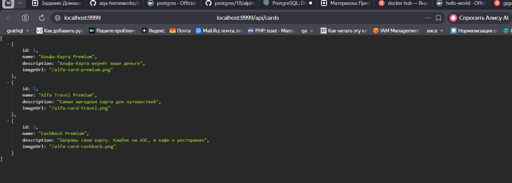

# Запуск приложения с PostgreSQL в Docker

## Описание
Приложение подключается к PostgreSQL, запущенному в Docker-контейнере, и отдаёт список карт через REST API.

## Как запустить
1. docker-compose up -d
2. java -jar db-api.jar

## Проверка
curl http://localhost:9999/api/cards

## Пример ответа

